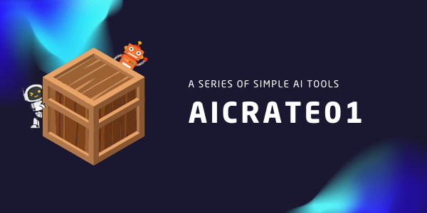

> **GadaGitGit**

### [Webgen](https://github.com/hizzybabe/webgen) - **alpha test release**

A web-based tool that generates custom webpage code using Google's Gemini AI. Users can specify their preferred CSS framework, page type, components, JavaScript features, and color palette to generate tailored webpage code.

### [Contentgen](https://github.com/hizzybabe/contentgen) - **alpha test release**

This web application leverages Google’s Gemini AI to create content based on user input, using Flask, HTML, CSS (Tailwind), and JavaScript.

### [Promptenhancer](https://github.com/hizzybabe/promptenhancer) - **alpha test release**

Prompt Enhancer is a web application that utilizes the Gemini API to enhance user prompts efficiently.

### [Rolegen](https://github.com/hizzybabe/rolegen) - **wip working on alpha*

A web application that generates customized AI role prompts using Google's Gemini AI.

[Bulkimg](https://github.com/hizzybabe/bulkimg) - **wip nearly alpha*

[Ratemyprompt](https://github.com/hizzybabe/ratemyprompt) - **wip nearly alpha*

[Txt2ColorPalette](https://github.com/hizzybabe/txt-2-color-palette) - **wip migrating in from Heroku*

[AI Text Summarizer](https://github.com/hizzybabe/ez-ai-summarizer) - **wip working on more features*